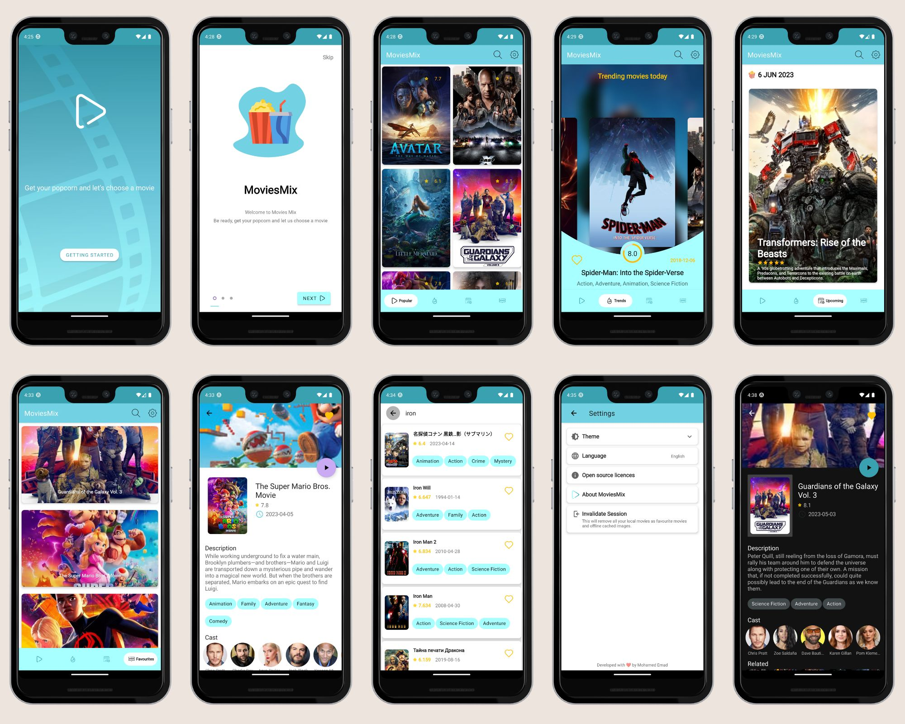

# MoviesMix 🎥🍿📱

This is an Android app built using Kotlin that showcases various features and libraries. The app
allows users to [describe the functionality of your app].

## Features ✨
* Explore the Upcoming, Popular and Trends Movies ✅
* Get detailed description of the movies. ✅
* Get Related movies. ✅
* Like your favourite movies. ✅
* Get movies trailer within the application. ✅
* Download movie poster and wallpapers. ✅
* Download cast profile images. ✅
* Search for movies. ✅
* Support dark/light themes. ✅
* Support multiple languages. ✅
* Cache movies data to show when mobile go offline. ✅
* API Level 26+ ✅

## Built With 🛠
- [Kotlin](https://kotlinlang.org/): First class and official programming language for Android
  development.
- [KTX](https://developer.android.com/kotlin/ktx): Kotlin extensions for Android, providing concise
  and idiomatic APIs.
- [Coroutines](https://github.com/Kotlin/kotlinx.coroutines): Asynchronous programming library for
  simplifying background operations.
- [Flow](https://developer.android.com/kotlin/flow): Reactive stream library for asynchronous and data-driven programming.
- [Retrofit](https://square.github.io/retrofit/)/[OkHttp3](https://square.github.io/okhttp/):
  Networking libraries for making HTTP requests.
- [Room](https://developer.android.com/jetpack/androidx/releases/room): Persistence library for
  local database storage.
- [Dagger-Hilt](https://dagger.dev/hilt/): Dependency injection library for Android.
- [Navigation Component](https://developer.android.com/guide/navigation): Android Jetpack's library
  for navigating between screens.
- [ViewModel-ktx](https://developer.android.com/jetpack/androidx/releases/lifecycle): Part of the
  Android Architecture Components for managing UI-related data.
- [WorkManager-KTX](https://developer.android.com/jetpack/androidx/releases/work): Library for
  performing background work in a flexible and efficient way.
- [Splash Screen](https://developer.android.com/jetpack/androidx/releases/core): Library for
  creating splash screens on Android.
- [Media3 ExoPlayer](https://developer.android.com/jetpack/androidx/releases/media3): Media playback
  library for Android.
- [Sandwich](https://github.com/skydoves/Sandwich): A lightweight and easy-to-use wrapper for
  Retrofit API calls.
- [Coil](https://github.com/coil-kt/coil): Image loading library for Android apps.
- [Lottie](https://github.com/airbnb/lottie-android): Animation library for Android.
- [VeilLayout](https://github.com/skydoves/androidveil): Library for showing shimmering loading
  placeholders.
- [PhotoView](https://github.com/chrisbanes/PhotoView): Zoomable image view library for Android.
- [SmoothBottomBar](https://github.com/ibrahimsn98/SmoothBottomBar): Customizable and animated
  bottom navigation bar library.
- [ShapeOfView](https://github.com/florent37/ShapeOfView): Library for creating various shapes for
  views in Android.
- [SparkButton](https://github.com/varunest/SparkButton): Customizable and animated button library.
- [SpringView](https://github.com/liaoinstan/SpringView): Pull-to-refresh and load-more library for
  Android.
- [Security-Crypto](https://developer.android.com/jetpack/androidx/releases/security): Library for
  encryption and decryption on Android.
- [Kotlin YouTubeExtractor](https://github.com/maxrave-dev/kotlin-youtubeExtractor): Library for
  extracting YouTube video links.
- [KenBurnsView](https://github.com/flavioarfaria/KenBurnsView): Customizable Ken Burns effect view
  library for Android.
- [MotionLayout](https://developer.android.com/training/constraint-layout/motionlayout): Library
  for creating and managing motion and widget animation in Android.
- [ViewBinding](https://developer.android.com/topic/libraries/view-binding): Feature that allows you
  to more easily write code that interacts with views.
- [Material Design Components](https://material.io/develop/android/docs/getting-started): Library
  for implementing Material Design UI components.

## Screenshots 📷


## Package Structure 📦

```
com.memad.moviesmix                                # Root Package
app                                                # Main Application Package
├── data/                                          # For data handling.
│   ├── local/                                     # Local Persistence Database. Room (SQLite) database
|   │   ├── MoviesDao.kt                           # Data Access Object for Room
|   |   |── Converters.kt                          # Type converters for Room
|   │   ├── FavouritesEntity.kt                    # Entity class for Room
|   │   ├── MoviesDB.kt                            # Database class that extends RoomDatabase
|   │   └── MovieEntity.kt                         # Entity class for Room         
│   ├── remote/                                    # Remote Data Handlers
|   │   ├── MoviesClient.kt                        # Retrofit API for remote end point.
|   │   └── StartClient.kt                         # Retrofit API for remote end point.
|   di/                                            # Dependency Injection
|   |── annotations/                               # Custom annotations for DI
|   |      ├── FavouritesRepoAnn.kt                # Custom annotation for Favourite repository
|   |      ├── PopularRepo.kt                      # Custom annotation for Popular repository
|   |      ├── TrendingRepo.kt                     # Custom annotation for Trending repository
|   |      ├── SessionKey.kt                       # Custom annotation for Session Key
|   |      └── UpcomingRepo.kt                     # Custom annotation for Upcoming repository
│   ├── ApiModule.kt                               # Provides Network dependencies.
│   ├── DatabaseModule.kt                          # Provides Database dependencies.
│   ├── ReposModule.kt                             # Provides Repositories dependencies.
│   └── UtilsModule.kt                             # Provides some other dependencies.
├── models/                                        # Model classes
|   |── AuthResponse.kt                            # Model class for Auth Response
|   |── Cast.kt                                    # Model class for Cast
|   |── CastResponse.kt                            # Model class for Cast Response
|   |── Movie.kt                                   # Model class for Movie
|   |── MovieResponse.kt                           # Model class for Movie Response
|   └── VideoResponse.kt                           # Model class for Video Trailer Response
├── repos/                                         # Repositories
|  |── DescriptionRepo.kt                          # Repository class for Movies Description
|  |── FavouritesRepo.kt                           # Base repository class for Favourites
|  |── FavoritesRepoImplentation.kt                # Implementation of Favourites repository
|  |── MainRepo.kt                                 # Base repository class for all type of movies(Popular, Trending, Upcoming)
|  |── mainRepoImpl.kt                             # Implementation of Main repository
|  └── SearchRepo.kt                               # Repository class for Search
├── ui/                                            # Activity/View layer
│   ├── main/                                      # Main Screen Activity & ViewModel (contains all components of the app)
|   |   ├── description/                           # Description Screen Fragment & ViewModel & Adapters (contains all components of the movie description)
|   |   |   ├── RecommendAdapter.kt                # Adapter for Recommended RecyclerView
|   |   |   ├── CastAdapter.kt                     # Adapter for Cast RecyclerView
|   |   |   ├── MovieDescriptionFragment.kt        # Fragment for Description Screen
|   |   |   └── DescriptionViewModel.kt            # ViewModel for Description Screen
|   |   ├── favourites/                            # Favourites Screen Fragment & ViewModel & Adapter (contains all components of the Favourites)
|   |   |   ├── FavouritesAdapter.kt               # Adapter for Favourites RecyclerView
|   |   |   ├── FavouritesFragment.kt              # Fragment for Favourites Screen
|   |   |   └── FavouritesViewModel.kt             # ViewModel for Favourites Screen
|   |   ├── popular/                               # Popular Screen Fragment & ViewModel & Adapter (contains all components of the Popular)
|   |   |   ├── PopularAdapter.kt                  # Adapter for Popular RecyclerView
|   |   |   ├── PopularFragment.kt                 # Fragment for Popular Screen
|   |   |   └── PopularViewModel.kt                # ViewModel for Popular Screen
|   |   ├── search/                                # Search Screen Fragment & ViewModel & Adapter (contains all components of the Search)
|   |   |   ├── SearchAdapter.kt                   # Adapter for Search RecyclerView
|   |   |   ├── SearchFragment.kt                  # Fragment for Search Screen
|   |   |   └── SearchViewModel.kt                 # ViewModel for Search Screen
|   |   ├── settings/                              # Settings Screen Fragment
|   |   |   └── SettingsFragment.kt                # Fragment for Settings Screen
|   |   ├── trending/                              # Trending Screen Fragment & ViewModel & Adapter (contains all components of the Trending)
|   |   |   ├── TrendingAdapter.kt                 # Adapter for Trending RecyclerView
|   |   |   ├── TrendingFragment.kt                # Fragment for Trending Screen
|   |   |   └── TrendingViewModel.kt               # ViewModel for Trending Screen
|   |   ├── upcoming/                              # Upcoming Screen Fragment & ViewModel & Adapter (contains all components of the Upcoming)
|   |   |   ├── UpcomingAdapter.kt                 # Adapter for Upcoming RecyclerView
|   |   |   ├── UpcomingFragment.kt                # Fragment for Upcoming Screen
|   |   |   └── UpcomingViewModel.kt               # ViewModel for Upcoming Screen
|   |   ├── viewer/                                # Viewer Screen for shioing movie trailer / images
|   |   |   ├── ViewerFragment.kt                  # Fragment for Viewer Screen
|   |   |   └── worker/                            # Worker for downloading images
|   |   |       ├── DownloadCompletedReceiver.kt   # Broadcast Receiver for downloading images
|   |   |       |── DownloadFile.kt                # Class for downloading images
|   |   |       └── DownloadImageWorker.kt         # WorkManager for downloading images
|   |   ├── MainActivity.kt                        # Main Activity
│   └── start/                                     # Start Screen Activity & ViewModel  (contains all components of crating session and onboarding)
|       ├── StartActivity.kt                       # Start Activity
|       ├── start/                                 # Start Screen Fragment & ViewModel (contains all components of the Start)
|       |   ├── StartFragment.kt                   # Fragment for Start Screen
|       |   └── StartViewModel.kt                  # ViewModel for Start Screen
|       └── onboarding/                            # Onboarding Screen Fragment & Adapter (contains all components of the Onboarding)
|           ├── OnboardingAdapter.kt               # Adapter for Onboarding RecyclerView
|           └── OnboardingFragment.kt              # Fragment for Onboarding Screen
├── utils/                                         # Utility Classes / Kotlin extensions
│   ├── AccessNative.kt                            # Native code for Accessing API key in the cpp file
│   ├── CenterZoomLayoutManager.kt                 # Custom LayoutManager for RecyclerView
│   ├── Constants.kt                               # Constants used throughout the app
|   ├── DoubleClickListener.kt                     # Double click listener for views
│   ├── Extensions.kt                              # Some Kotlin extension functions to help
│   ├── GenresUtils.kt                             # Helper class for getting genres (as string) of movies
│   ├── LocaleExt.kt                               # Extension function for getting/setting current locale
│   ├── Mapper.kt                                  # Mapper class for mapping data from MoviesResponse to MovieEntity
│   ├── NetworkUtils.kt                            # Network Status as Reactive helper class
│   ├── PermissionHelper.kt                        # Helper class for checking and requesting permissions
│   ├── Resource.kt                                # A generic class that holds a value with its loading status.
│   ├── SwipeToDelete.kt                           # Helper class for swipe to delete in RecyclerView
│   └── SharedPreferencesHelper.kt                 # Helper class for storing data in SharedPreferences
└── App.kt                                         # Application class
```


## Architecture: MVVM 🔨


## API Key Storage: NDK 🔑

To securely store the API key used in the app, we utilize the Native Development Kit (NDK) to store
the key in native code. This helps prevent the key from being easily extracted from the app's
compiled code.

If you need to use an API key in the app, follow these steps:

1. Obtain your API key from [TMDB](https://www.themoviedb.org/settings/api).
2. Navigate to the `jni` directory in the project.
3. create a new file called `api_key.cpp` and add the following code:
```cpp
#include <jni.h>
JNIEXPORT jstring;
jstring
Java_com_memad_moviesmix_utils_AccessNative_getApiKey(JNIEnv *env, jobject thiz) {
    return (*env)->  NewStringUTF(env, "YOUR_API_KEY_HERE");
}
```
4. Replace `YOUR_API_KEY_HERE` with your API key.
5. Build the project to generate the native library file that contains the API key.


## License 📃

This project is licensed under the [MIT License] License - see the [LICENSE](LICENSE) file
for details.
